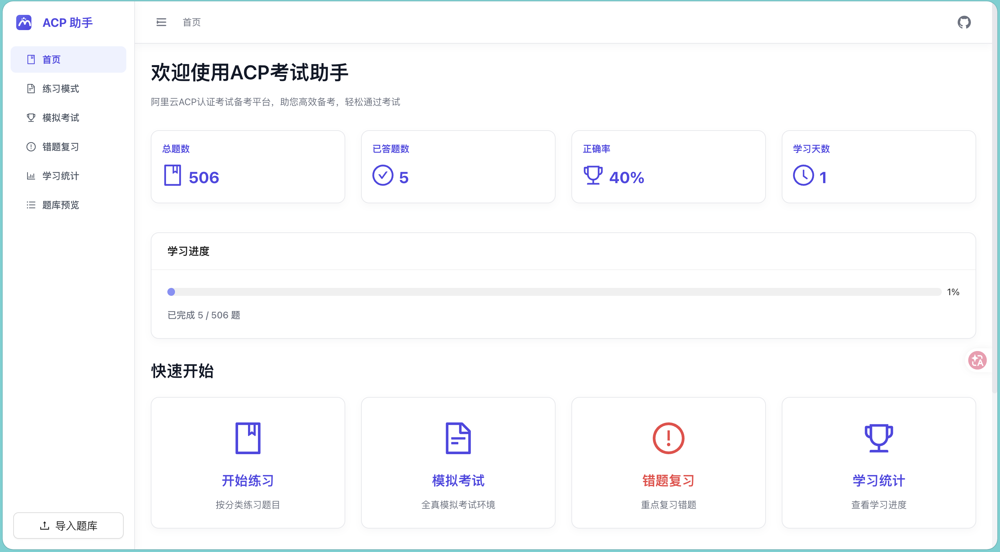
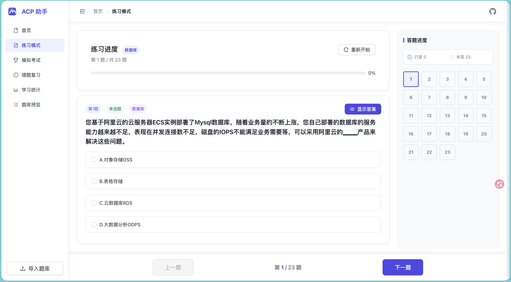

# ACP 考试助手

阿里云 ACP 认证刷题工具。项目是一个纯前端 React 应用，内置题库，也支持导入 JSON 题库；练习记录、错题和考试历史保存在浏览器 localStorage。

在线体验：[acp-exam-prep.vercel.app](https://acp-exam-prep.vercel.app/)

## 截图

| 首页 | 练习模式 |
|------|----------|
|  |  |

首页展示当前题库信息、答题进度统计（正确率/已答题数/学习天数）以及各功能模块的快捷入口。练习模式支持按分类筛选或随机抽题，顶部显示答题进度条和答题卡，每题可查看答案与解析。

## 功能

- 首页：展示当前题库、答题进度、正确率和快速入口
- 练习模式：按分类练习或随机练习，答题后显示答案和解析
- 模拟考试：限时答题，交卷后保存考试记录
- 错题复习：自动收集错题，支持移除已掌握题目
- 学习统计：展示答题趋势、分类分布和考试历史
- 题库预览：查看当前题库题目和分类
- 题库导入：上传 JSON 文件并切换到导入题库

## 技术栈

- React 19
- TypeScript
- React Router 7
- Ant Design 5
- Styled Components 6
- Recharts 3
- Create React App

## 运行

```bash
npm install
npm start
```

构建生产包：

```bash
npm run build
```

运行测试：

```bash
npm test
```

## 项目结构

```text
src/
├── components/
│   ├── ImportModal.tsx
│   ├── Layout.tsx
│   └── QuestionCard.tsx
├── data/
│   ├── questions.ts
│   └── subject.ts
├── pages/
│   ├── Exam.tsx
│   ├── Home.tsx
│   ├── Practice.tsx
│   ├── Preview.tsx
│   ├── Review.tsx
│   └── Statistics.tsx
├── utils/
│   └── storage.ts
├── App.tsx
├── index.tsx
└── tokens.css
```

## 题库格式

导入文件可以是题目数组，也可以是包含 `questions` 字段的对象：

```json
{
  "name": "示例题库",
  "shortName": "示例",
  "description": "导入题库说明",
  "questions": [
    {
      "id": 1,
      "type": "single",
      "title": "OSS 的基本数据单元是什么？",
      "options": ["A.Object", "B.Bucket", "C.Service", "D.安全组"],
      "answer": "A",
      "explanation": "OSS 的基本数据单元是对象 Object。",
      "category": "OSS"
    },
    {
      "id": 2,
      "type": "multiple",
      "title": "以下哪些是阿里云的安全服务？（多选）",
      "options": ["A.云盾", "B.安骑士", "C.DDoS高防IP", "D.SLB"],
      "answer": "ABC",
      "explanation": "SLB是负载均衡服务，不属于安全服务。",
      "category": "安全"
    },
    {
      "id": 3,
      "type": "judge",
      "title": "阿里云对象存储OSS支持图片处理功能。",
      "options": ["A.对", "B.错"],
      "answer": "A",
      "explanation": "OSS支持图片处理，包括缩放、裁剪、水印等功能。",
      "category": "OSS"
    }
  ]
}
```

### 字段说明
- `type`: 题目类型，必须为英文值：`"single"` (单选题), `"multiple"` (多选题), `"judge"` (判断题)。
- `options`: 选项数组。若是判断题，通常为两个元素（如 `["A.对", "B.错"]`）。
- `answer`: 答案。多选题答案为无分隔的连续大写字母（如 `"ABC"`）。
- `category`: 题目分类，用于按分类练习和进度统计。

> [!WARNING]
> **本地存储限制**：练习进度、错题本和导入的题库数据均保存在浏览器 `localStorage` 中。`localStorage` 的容量上限一般为 5MB，请避免导入超大型题库。另外，清理浏览器缓存或使用无痕模式会导致刷题数据丢失，请妥善备份您的 JSON 题库源文件。
