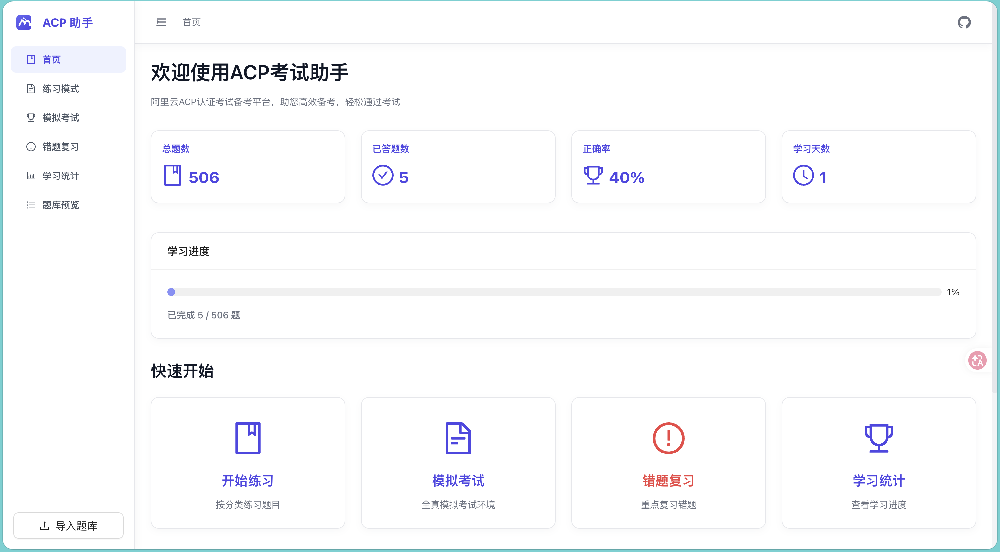

<div align="center">
  
  <h1>Salesforce Platform Developer I 考试助手</h1>
</div>

Salesforce Platform Developer I 认证刷题工具。项目是一个纯前端 React 应用，内置 7 个自测题库，共 253 道独立练习题；另有 2 套各 65 题的模拟卷，模拟卷题目均从原有练习题中抽取。也支持导入相同格式的 JSON 题库。练习记录、错题和考试历史保存在浏览器 localStorage。

在线体验：[acp-exam-prep.vercel.app](https://acp-exam-prep.vercel.app/)

## 截图

> 截图沿用旧版本，仅用于展示界面布局。

| 首页 | 练习模式 |
|------|----------|
|  |  |

## 功能

- 考点练习：开发基础、流程自动化与逻辑、用户界面、测试/调试/部署
- 单选与多选：支持多答案选择、分值、难度和题目正确率展示
- 模拟考试：内置模拟卷 A/B，限时答题并保存考试记录
- 错题复习：自动收集错题并回显用户答案
- 学习统计：展示答题进度、正确率、分类分布和考试历史
- 题库预览：搜索、筛选并查看题目答案与解析
- 题库导入：上传 Salesforce 格式的 JSON 题库

## 技术栈

- React 19
- TypeScript
- React Router 7
- Ant Design 5
- Styled Components 6
- Recharts 3
- Create React App

## 运行

```bash
npm install
npm start
```

构建生产包：

```bash
npm run build
```

运行测试：

```bash
npm test
```

## 项目结构

```text
src/
├── components/
│   ├── ImportModal.tsx
│   ├── Layout.tsx
│   └── QuestionCard.tsx
├── data/
│   ├── salesforce-banks/
│   ├── salesforce.ts
│   └── subject.ts
├── pages/
│   ├── Exam.tsx
│   ├── Home.tsx
│   ├── Practice.tsx
│   ├── Preview.tsx
│   ├── Review.tsx
│   └── Statistics.tsx
├── utils/
│   └── storage.ts
├── App.tsx
├── index.tsx
└── tokens.css
```

## 题库格式

导入文件可以是题目数组，也可以是包含 `questions` 字段的对象：

```json
{
  "name": "Salesforce Platform Developer I 示例题库",
  "shortName": "Platform Developer I",
  "description": "Platform Developer I 练习题",
  "questions": [
    {
      "type": "multiple_choice",
      "question": "Which two options are correct?",
      "score": 1,
      "chooseCount": 2,
      "options": [
        { "key": "A", "text": "Option A" },
        { "key": "B", "text": "Option B" },
        { "key": "C", "text": "Option C" },
        { "key": "D", "text": "Option D" }
      ],
      "userAnswers": [],
      "correctAnswers": ["A", "C"],
      "explanation": {
        "A": "Option A is correct.",
        "C": "Option C is correct."
      },
      "difficulty": "简单",
      "accuracy": 88
    }
  ]
}
```

### 字段说明

- `type`：`single_choice`（单选）或 `multiple_choice`（多选）。
- `question`：题目正文，支持 HTML。
- `score`：题目分值。
- `chooseCount`：应选答案数量，必须与 `correctAnswers` 数量一致。
- `options`：选项数组，每项包含唯一的 `key` 和选项 `text`。
- `userAnswers`：已有用户答案，可为空数组。
- `correctAnswers`：正确答案键数组。
- `verifiedAnswers`：可选的人工复核答案；存在时优先用于答案显示和判定，否则使用 `correctAnswers`。
- `explanation`：按答案键保存的解析对象。
- `verifiedExplanation`：可选的人工复核解析；存在时优先显示，原解析保留在 `explanation` 中。
- `difficulty`：题目难度。
- `accuracy`：题目来源提供的正确率，范围为 0–100。

> [!WARNING]
> 练习进度、错题本、考试历史和导入题库均保存在浏览器 `localStorage` 中。清理浏览器数据或使用无痕模式会导致记录丢失，请保留 JSON 题库源文件。
